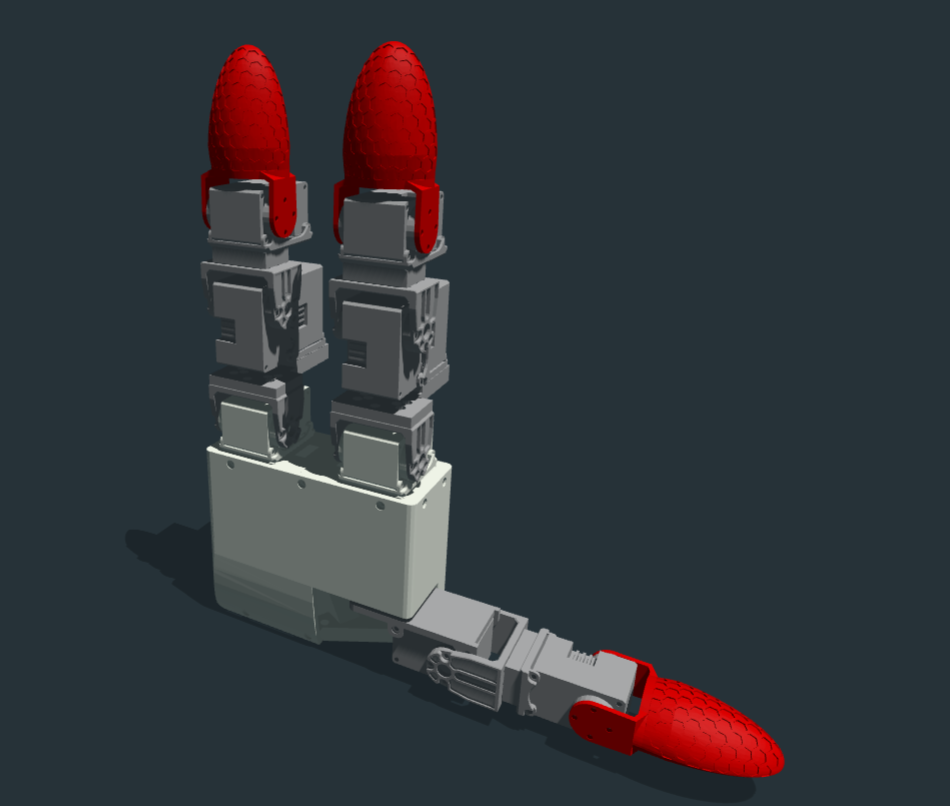

## Dexterous Hand GX11

### 3D Printing
The extra componets for the GX11 are listed in `stl` folder.

### Others
* OpenRB-150 motor control board.
* Type-C USB cable
* 11 Dynamixel XL330-M288-T motors.
* 5V 15A DC power.
* Standard components for XL330-M288-T motors, S101, S102, FPX330.
* EH2.54 3pin connectors.

### Assembly
Assembly all the motors and components together, like followings (home position):


### Zero Position

```python
from libgex.libgx11 import Hand

hand = Hand(port="/dev/ttyACM0") # COM* for Windows, ttyACM* or ttyUSB* for Linux
hand.connect()

print(hand.getj())
# set hand zero, call off() first
hand.off()
hand.set_zero_whole_hand()
print(hand.getj())
```
